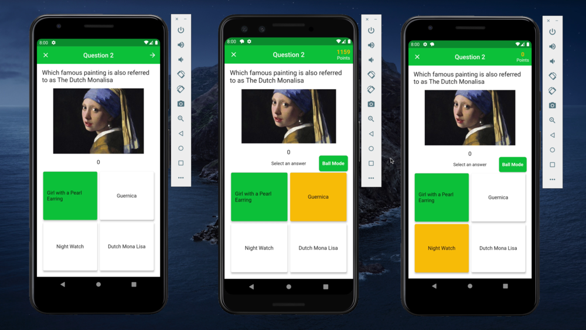

# smart-broccoli

Fun quiz app for school lecturers and students to interact with each other in and after class. <br>
Multiple sensors are used in the app, such as Gyroscope, GPS, Calendar, Wifi and Ambient Light Sensor.

## Prerequisite
* [Android Studio 4.1](https://developer.android.com/studio)
* Android SDK which can be obtained when launch Android Studio first time. Version: >=2.7.0 && <3.0.0
* [Flutter installation](https://flutter.dev/docs/get-started/install)
* [Android phone or emulator with API level 30](https://developer.android.com/studio/run/managing-avds) with google player services (for firebase)

For detailed installation instructions of Android studio and Flutter, please refer to their corresponding official websites. Environment variables should be configured these processes.

## Dependencies
For details of the dependencies used in this project, please refer to the following pubspec.yaml files.
```
pubspec.yaml
```
Please run ```flutter pub get``` in terminal every time update pubspec.yaml file.

## Code Structure
* Backend ```backend```: see [README.md](https://github.com/comp90018-2020/smart-broccoli/blob/master/backend/README.md)
* Base ```lib/src/base```: Contains supporting classes.
* Data ```lib/src/data```: Contains domain and data transfer objects. Includes: User, Quiz, Game, Group, Answer and Outcome. Please refer to the file for detailed attributes of each data type defined here.
* Frontend ```lib/src/ui```: Contains all UI pages. These submodules are groupings of features for code separation.
  * ```/about```: Acknowledgement and LICENSE pages.
  * ```/auth```: UI for registration and login, including joining as a participant.
  * ```/group``` and ```/groups```: UI of group management, including group creation and listing.
     Also includes quiz tabs which allows for switching between different quiz types.
  * ```/notification```: Notification settings.
  * ```/profile```:  User profile and management.
  * ```/quiz``` and ```quiz_creator```: Quiz card UI, including UI of quiz creation and management.
  * ```/session```: Session UI pages. Contains waiting lobby page, question page, answer page, and leaderboard page.
  * ```/shared```: Custom components used by all UI pages.
* Sensor ```lib/src/background```: Sensors implementation.
* Services
  * ```lib/src/models```: Used for storing and updating logic state, and be as a middle layer service
  * ```lib/src/store```: Contains APIs that used for data transfer between server and UI pages

## Building and Running
### With Android Studio
1. Clone this repository locally.
2. Open Android Studio, select File -> Open and open the root of your local repository.
3. Before build and run, make sure the Android emulator is available. Select Tool -> AVD manager. Click <create virtual device> button if there is no Android virtual machine, then follow the guideline to complete the installation, this process may take a little bit of time. After that, select and launch one emulator in the list of Android Virtual Devices Manager window.
4. To build and run the app, select menu item Run -> Run and then in the popup dialog, select smart broccoli app.

### With command line

```
flutter run
```

### Youtube Demo
<a href="https://youtu.be/FaRWcm23kP4">
  
</a>
